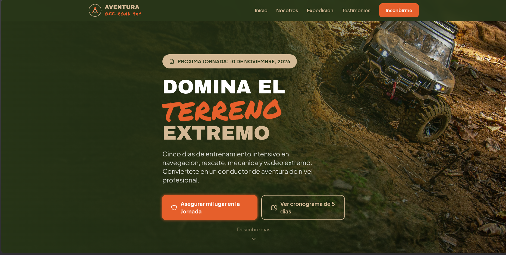
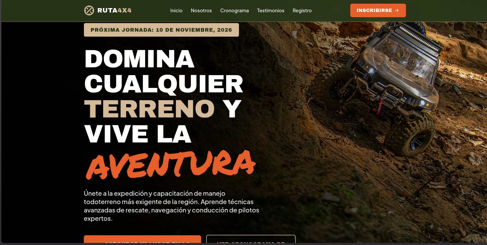
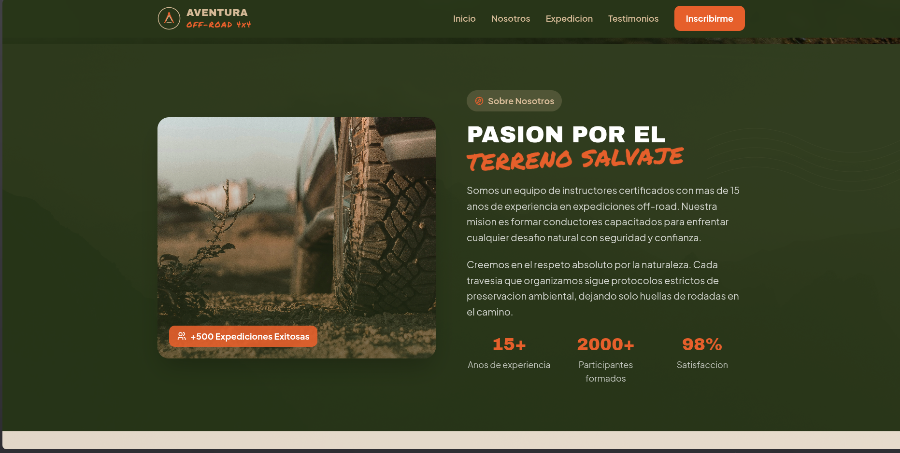
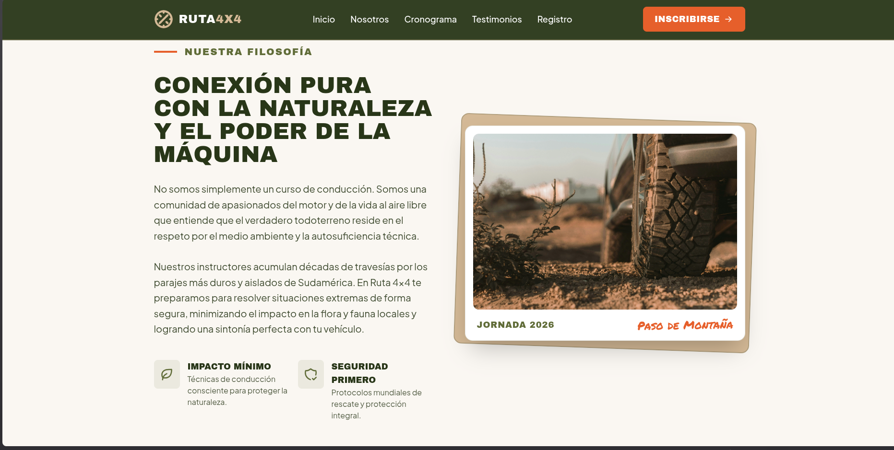
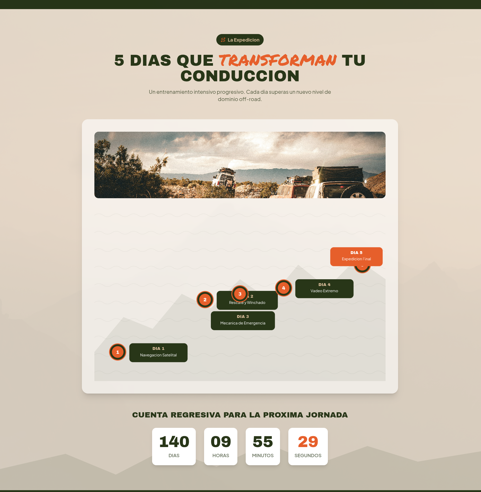
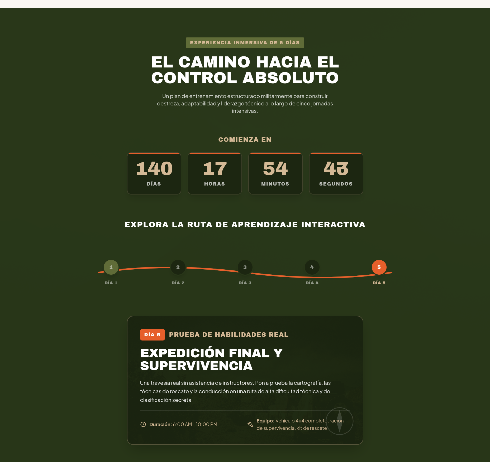
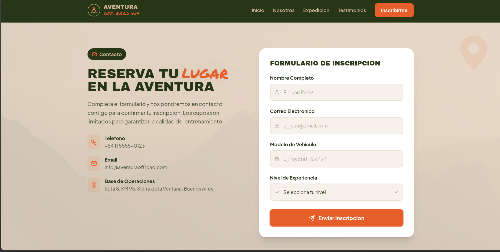

# Practica Formativa Obligatoria 2 - Desarrollo de Sistemas Frontend

**Instituto de Formacion Tecnica Superior N.° 29 (IFTS N.°29)**  
Materia: Desarrollo de Sistemas Frontend  
Entrega: Portada de Acceso Unificada con Landing Pages Autogeneradas

---

## Datos del Estudiante

| Campo | Valor |
|---|---|
| **Nombre** | Leandro Ezequiel |
| **Apellido** | Rocha |
| **Comision** | D |

---

## Link al Deploy Unificado

```
[Pendiente — agregar URL de Vercel]
```

---

## Introduccion y Objetivo Academico de Fondo

Este repositorio aloja el trabajo practico correspondiente a la Practica Formativa Obligatoria 2 (PFO2) de la materia Desarrollo de Sistemas Frontend, perteneciente a la carrera Tecnicatura Superior en Desarrollo de Software del IFTS N.°29.

El objetivo profundo de esta practica trasciende la mera construccion de una pagina web. Se trata de un ejercicio integral de **gestion y orquestacion de agentes de codificacion autonomos**, cuyo proposito es:

- Explorar y contrastar las capacidades de distintos agentes de IA aplicados al desarrollo frontend.
- Evaluar de forma critica las fortalezas y debilidades de cada herramienta frente a un mismo requerimiento funcional y estetico.
- Comprender el **impacto determinante que tiene el diseno de un prompt de alta precision** (Prompt Engineering) en la calidad y coherencia del resultado final.
- Desarrollar criterio para seleccionar y combinar agentes segun el contexto del proyecto.

Cada agente recibio el mismo conjunto de instrucciones —redactado integramente en ingles— debiendo generar de forma autonoma una landing page completa, autocontenida, funcional y esteticamente alineada con la tematica solicitada.

---

## Tematica del Sitio y Objetivo de Conversion

La landing page encargada a ambos agentes pertenece a una **organizacion de expediciones y aventuras en vehiculos 4x4**, conceptualizada como un emprendimiento que ofrece experiencias de capacitacion intensiva en conduccion off-road.

### Identidad Visual

- **Paleta de colores:** Tonos pastel desaturados compuestos por camel, verde aventura y marron tierra, con acentos en naranja alerta para llamadas a la accion.
- **Tipografia:** Combinacion de una familia heading agresiva y robusta (Archivo Black) con una fuente body moderna (Plus Jakarta Sans), mas un acento adventure en Permanent Marker para palabras clave.
- **Estetica general:** Ambiente pastel pero aventurero, con fondos texturizados, iconografia vectorial y componentes visuales de alto impacto.

### Objetivo de Negocio (Conversion)

El sitio no es meramente informativo. Su proposito real es la **captura de leads e inscripciones** para una jornada intensiva de capacitacion de 5 dias, planificada para **noviembre de 2026**. Toda la arquitectura visual esta disenada para conducir al usuario hacia la accion de registro, ya sea a traves del formulario de contacto, los contadores regresivos que generan urgencia o los testimonios que proveen prueba social.

---

## Agentes y Modelos Utilizados

La siguiente tabla compara las herramientas empleadas para resolver el diseno de forma autonoma:

| Aspecto | Primer Agente | Segundo Agente |
|---|---|---|
| **Nombre del agente** | OpenCode | Antrigravity |
| **Modelo de lenguaje** | Mimo v2.5 | Gemini 3.5 Flash con Razonamiento Medio |
| **Tipo de licencia** | Gratuita | Gratuita |
| **Archivo generado** | `./opencode/index.html` | `./antigravity/index.html` |
| **Enfoque de salida** | Landing Page completa y autocontenida | Landing Page completa y autocontenida |

Ambos agentes recibieron el **mismo prompt maestro** (ver seccion correspondiente) y trabajaron sobre los mismos assets graficos locales (`../imgs/hero.jpg`, `../imgs/nosotros.jpg`, `../imgs/capacitacion.jpg`, `../imgs/textura.jpg`), lo que permite una comparacion directa y equitativa de sus prestaciones.

---

## Estructura de Archivos

El proyecto se organiza de la siguiente manera:

```
PROYECTO-PFO2/
│
├── README.md                    # Documentacion del proyecto (este archivo)
├── index.html                   # Portada de acceso unificada (raiz)
├── prompt.txt                   # Prompt maestro utilizado con ambos agentes
│
├── opencode/
│   └── index.html               # Landing Page generada por OpenCode
│
├── antigravity/
│   └── index.html               # Landing Page generada por Antrigravity
│
├── imgs/
│   ├── hero.jpg                 # Imagen de fondo para la seccion Hero
│   ├── nosotros.jpg             # Imagen para la seccion Sobre Nosotros
│   ├── capacitacion.jpg         # Imagen para la seccion de capacitacion
│   ├── textura.jpg              # Textura de fondo para secciones intermedias
│   └── caps/                    # Capturas de pantalla (ver seccion de evidencia)
```

### Funcion de cada componente

- **`index.html` (raiz):** Portada de acceso general que unifica los tres destinos principales: visualizacion del prompt en un modal interactivo, acceso a la landing de OpenCode y acceso a la landing de Antrigravity. Incluye los datos del estudiante con marcadores de posicion.
- **`opencode/index.html`:** Landing Page comercial completa generada autonomamente por el agente OpenCode con el modelo Mimo v2.5.
- **`antigravity/index.html`:** Landing Page comercial completa generada autonomamente por el agente Antrigravity con el modelo Gemini 3.5 Flash.
- **`prompt.txt`:** Archivo de texto que contiene el prompt maestro en ingles, utilizado como entrada identica para ambos agentes.

---

## El Prompt Exacto Utilizado

A continuacion se presenta el prompt maestro que fue suministrado a ambos agentes de codificacion. Este documento fue redactado integramente en ingles y contiene las especificaciones tecnicas, esteticas y funcionales que cada agente debio interpretar y ejecutar de forma autonoma.

````md
You are an elite Front-End Developer and UI/UX Designer. Your task is to generate a single, completely self-contained, production-ready, and highly engaging responsive Landing Page file named `index.html`.

You must strictly follow the architectural, design, and structural guidelines detailed below.

---

## 🌍 Language and Output Constraints

* **Prompt Language:** This instruction is in English, but **all website copy, text, labels, buttons, and content inside the HTML file must be written completely and strictly in SPANISH**.
* **Single File Delivery:** You must generate exactly **one single file: `index.html**`. It must contain all HTML structure, inline Tailwind configuration script, inline custom CSS styles (if needed for keyframe animations), and inline JavaScript for interactive elements. Absolutely no external `.css` or `.js` files are permitted.

---

## 🛠️ Technical Stack & Dependencies

Include these exact CDN resources in the `<head>` of the document:

1. **Tailwind CSS CDN:** `<script src="[https://cdn.tailwindcss.com](https://cdn.tailwindcss.com)"></script>`
2. **Google Fonts CDN:** Link the following fonts: `Archivo Black`, `Plus Jakarta Sans`, and `Permanent Marker`.
3. **Tabler Icons:** Include the CSS CDN link to render interface icons using `<i>` elements or inline SVGs.

### Tailwind Custom Theme Configuration

You must embed the following exact custom theme configuration inside a `<script>` tag right below the Tailwind CDN to maintain design tokens globally:

```javascript
tailwind.config = {
  theme: {
    extend: {
      colors: {
        camel: '#D4B996',
        aventuraVerde: '#606C38',
        tierraMarron: '#283618',
        alertaNaranja: '#E65F2B', // Desaturado para acentos impactantes
      },
      fontFamily: {
        heading: ['Archivo Black', 'sans-serif'],
        body: ['Plus Jakarta Sans', 'sans-serif'],
        adventure: ['Permanent Marker', 'cursive'],
      }
    }
  }
}

```

---

## 🎨 UI/UX & Design System Rules

### 1. Typography Hierarchy & Size Restriction

* **Headings:** Use `font-heading` (`Archivo Black`). They must be massive, heavy, and striking.
* **Body:** Use `font-body` (`Plus Jakarta Sans`).
* **Acento/Highlights:** Use `font-adventure` (`Permanent Marker`) for specific key words within headlines to break generic layouts.
* **STRICT SIZE GUARDRAIL:** You are **strictly prohibited** from using small text utility classes like `text-sm` or `text-xs`. The entire website is a highly promotional tool; all text must be prominent and highly readable. The absolute minimum font size for any element (including footer copyright or labels) is `text-base` or `text-lg`.

### 2. Color Palette Application

* Apply a pastel yet adventurous environment. Use backgrounds blending light tones of `camel` or soft off-whites, contrasted against deep `tierraMarron` or `aventuraVerde` text and containers. Use `alertaNaranja` strictly as an accent color for highlights, crucial badges, and main call-to-actions.

### 3. Visual Decor & Media Assets

* **NO EMOJIS:** Do not use emojis anywhere on the page under any circumstance.
* **Icons & Custom SVGs:** Use Tabler Icons for standard interface actions. Embed rich, inline vector SVGs for brand patterns (such as compass elements, trail paths, topographic maps, or pins) to create background textures.
* **Local Image References:** You must strictly use the following relative file paths for images. Do not use external placeholders or Unsplash URLs:
* **Hero Background Image:** `../imgs/hero.jpg` *(Visual composition note: This image features an off-road vehicle positioned on the right side under high light, while the left side consists of dark, heavy rock shadows. You must place your massive light-colored typography over this dark left area for perfect organic contrast).*
* **About Us Image:** `../imgs/nosotros.jpg`
* **Training Workshop Image:** `../imgs/capacitacion.jpg`
* **Section Background Texture:** `../imgs/textura.jpg` *(A misty, desaturated mountain landscape. Use this as a subtle, low-opacity full-width background or fixed background cover on intermediate sections to eliminate flat white backgrounds).*


### 4. Motion & Animations

* Implement smooth entry and exit transitions for standard components (e.g., hover states on cards and nav items).
* Implement prominent, high-engagement, striking animations for critical focal points:
* Apply a subtle attention-grabbing pulse or rotation on the `alertaNaranja` primary button.
* Animate the counting intervals of the timer components.
* Slightly tilt or animate the adventure accent phrases to make them stand out.


---

## 🗺️ Mandatory Landing Page Sections

The document must strictly render the following 7 functional sections in order, fully content-populated in Spanish:

### 1. Cabecera (Header)

* A responsive top navigation bar featuring a stylized vector inline-SVG logo.
* Large navigation menus utilizing prominent text sizes.
* Includes a mobile hamburger button controlled by an inline JavaScript toggle function.

### 2. Hero Section (High-Impact Header)

* Utilizes `../imgs/hero.jpg` as a full-bleed or highly integrated background context, overlaying massive typography text over the dark, shaded left quadrant of the graphic layout.
* **The Date Badge:** Feature a highly visible banner component with a `camel` background and `tierraMarron` text declaring: "PRÓXIMA JORNADA: 10 DE NOVIEMBRE, 2026".
* **Main Title:** A massive layout (`text-5xl` or `text-6xl`) using `font-heading`. Include your stylized accent word using `font-adventure text-alertaNaranja rotate-[-2deg] inline-block` to disrupt the corporate look.
* **Double Call-To-Action:**
* *Primary Button:* A large, prominent element filled with `alertaNaranja` featuring an active motion pulse effect and an icon, labeled "Asegurar mi lugar en la Jornada".
* *Secondary Button:* A transparent ghost design outlined in `camel` labeled "Ver cronograma de 5 días", which acts as an anchor scrolling smooth target down to Section 4.


### 3. Descripción / Sobre Nosotros (About Us)

* An editorial layout displaying the organization's core values, mission, and respect for nature using `../imgs/nosotros.jpg`.
* Maintain clean line-heights and text configurations no smaller than `text-lg`.

### 4. Sección de Servicios / Características (The Training Journey & "Wow" Element)

* This section focuses entirely on pitching the intensive 5-day training expedition.
* **The "Wow" Component:** Create a completely custom, visual, and beautiful **vertical or horizontal SVG Trail Map path** representing a mountain track line. Each stop/milestone along this vector trail track represents one day of the 5-day event (e.g., Día 1: Navegación Satelital, Día 2: Rescate y Winchado, Día 3: Mecánica de Emergencia, Día 4: Vadeo Extremo, Día 5: Expedición Final).
* **Countdown Timer:** Integrate a functional inline JavaScript countdown timer component locking onto the target date of November 10, 2026. Style the individual digits using large, organic card modules.

### 5. Testimonios o Reseñas (Social Proof)

* A highly polished feedback row or grid showcasing reviews from past participants.
* Avoid small text formats. Review titles, author blockages, and blockquotes must maintain high visibility hierarchies.

### 6. Formulario de Contacto (Maquetado Visual Only)

* A beautiful visual form module styled entirely within the pastel palette.
* Includes fields for Full Name, Email, Vehicle Model, and Experience Level.
* No backend interaction code is required, but it must be layout-complete, highly styled, interactive on input focuses, and feature a bold registration submit button.

### 7. Pie de Página (Footer)

* A bottom summary block including structural navigation mirroring, copyright legal texts using proper size configurations (minimum `text-base`), and social channel links rendered via clean Tabler Icons.

---

## 🛑 Execution Rule

Decline any temptation to truncate code, use inline code placeholders like `<!-- section comes here -->`, or write incomplete HTML tags. Produce the complete, valid, beautifully styled, and ready-to-render source code file from the initial `<!DOCTYPE html>` declaration to the closing `</html>` marker. Ensure all Spanish text contains accurate punctuation and accents.

````

---

## Evidencia Visual (Capturas de Pantalla)

La siguiente galeria comparativa permite evaluar visualmente las diferencias en la interpretacion y ejecucion de cada agente sobre las mismas secciones funcionales. Las imagenes se almacenan en el directorio `./imgs/caps/`.

### Seccion Hero (Impacto Inicial)

| Agente OpenCode (Mimo v2.5) | Agente Antrigravity (Gemini 3.5 Flash) |
|---|---|
|  |  |


### Seccion Nosotros (Estructura Editorial)

| Agente OpenCode (Mimo v2.5) | Agente Antrigravity (Gemini 3.5 Flash) |
|---|---|
|  |  |


### Seccion "Wow" — Ruta Interactiva SVG (Cronograma de 5 Dias)

| Agente OpenCode (Mimo v2.5) | Agente Antrigravity (Gemini 3.5 Flash) |
|---|---|
|  |  |


### Formulario de Contacto (Maquetado Visual de Conversion)

| Agente OpenCode (Mimo v2.5) | Agente Antrigravity (Gemini 3.5 Flash) |
|---|---|
|  |  |
